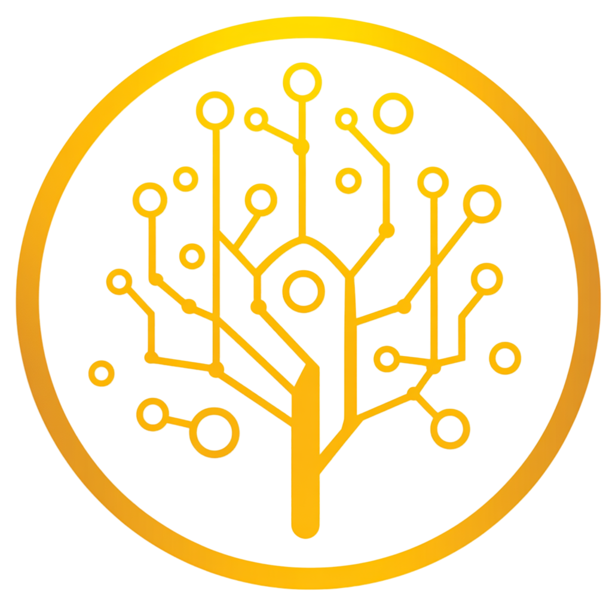

# Unified Intent Mediator (UIM) Protocol

  
  
A standardized protocol for intent-based communication between AI agents and web services

## What is the UIM Protocol?

The Unified Intent Mediator (UIM) Protocol defines a standardized framework for AI agents to interact with web services through well-defined intents, metadata, and execution methods. By introducing consistency and security in these interactions, UIM enhances efficiency, scalability, and reliability for AI-driven applications.

## Key Features

- **Intent-Based Communication**: Standardized format for expressing user intents that can be understood by both AI agents and web services
- **Secure Authentication**: Robust authentication mechanisms using RSA key pairs for secure data transmission
- **Service Discovery**: Centralized discovery service that allows AI agents to find and interact with compatible web services
- **Policy Management**: System for defining and enforcing usage policies, permissions, and constraints
- **Mock Implementations**: Reference implementations (mock agent and webservice) to demonstrate the protocol in action

## Why UIM Protocol?

As AI technology advances, there is a growing need for efficient, standardized interactions between AI agents and web services. Traditional methods such as web scraping and simulated user interactions are inefficient, unreliable, and often non-compliant with legal and ethical standards.

The UIM Protocol addresses these challenges by providing a standardized, secure method for direct AI agent-web service interaction, enabling:

- **Streamlined Interaction**: Eliminates the need for simulated user actions
- **Enhanced Functionality**: Exposes a wide range of web service functionalities as intents
- **New Revenue Streams**: Allows service providers to monetize intent access/usage
- **Improved Efficiency**: Reduces task completion time and enhances user experience
- **Robust Security**: Incorporates encrypted communications and secure authentication

## Getting Started

- [Read the Specification](specification/overview.md) to understand the protocol in detail
- [Follow the Guides](guides/getting-started.md) to implement the protocol in your applications
- [Explore the Reference](reference/odrl-vocabulary.md) for technical details
- [Check out the Prototypes](prototypes/overview.md) to see the protocol in action
- [Join the Community](community/contributing.md) to contribute to the protocol's development

## Current Status

The UIM Protocol is currently in the draft proposal stage. We're inviting developers, AI providers, service operators, and tech/AI enthusiasts to review the specification, test the implementation, and share feedback.

  <a href="specification/overview" class="md-button md-button--primary">Read the Specification</a>
  <a href="guides/getting-started" class="md-button">Get Started</a>

