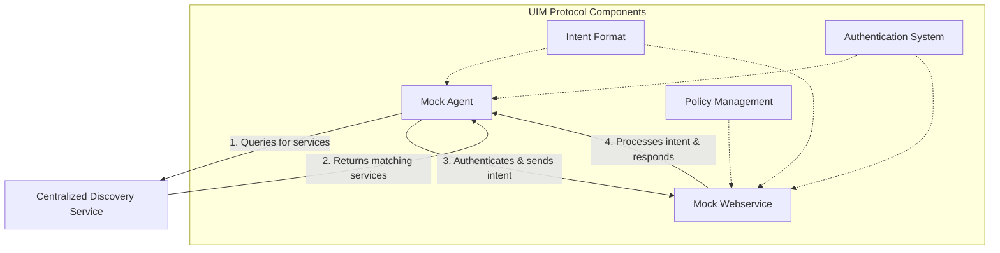

# UIM Protocol Prototype Implementations

Welcome to the UIM Protocol Prototype Implementations section. This section provides information about the reference implementations of the UIM Protocol, which demonstrate how the protocol works in practice.

## Available Prototypes

- [Overview](overview.md): A high-level overview of the prototype implementations
- [Discovery Service](discovery-service.md): Documentation for the centralized discovery service
- [Mock Agent](mock-agent.md): Documentation for the mock AI agent
- [Mock Webservice](mock-webservice.md): Documentation for the mock web service

## Purpose of Prototypes

The prototype implementations serve several important purposes:

1. **Demonstration**: They demonstrate how the UIM Protocol works in practice, showing the interactions between AI agents and web services.
2. **Validation**: They validate the protocol specification, ensuring that it is implementable and functional.
3. **Reference**: They provide a reference for developers implementing the protocol in their own applications.
4. **Testing**: They enable testing of the protocol in a controlled environment.

## Architecture

The prototype implementations follow a hybrid architecture, combining elements of both centralized and decentralized approaches:



## Getting Started with Prototypes

To get started with the prototype implementations:

1. **Clone the Repository**:
   ```bash
   git clone https://github.com/synaptiai/uim-protocol.git
   ```

2. **Set Up the Discovery Service**:
   ```bash
   cd uim-protocol/implementations/centralized-discovery-service
   # Follow instructions in discovery-service.md
   ```

3. **Set Up the Mock Webservice**:
   ```bash
   cd uim-protocol/implementations/uim-mock-webservice
   # Follow instructions in mock-webservice.md
   ```

4. **Set Up the Mock Agent**:
   ```bash
   cd uim-protocol/implementations/uim-mock-agent
   # Follow instructions in mock-agent.md
   ```

5. **Test the Interactions**:
   ```bash
   # Follow instructions in overview.md
   ```

## Development Status

The prototype implementations are currently in active development. They are functional but may not implement all features of the protocol specification. We welcome contributions to improve and extend the prototypes.

## Contributing

If you'd like to contribute to the prototype implementations, please see the [Contributing Guide](../community/contributing.md) for more information.
