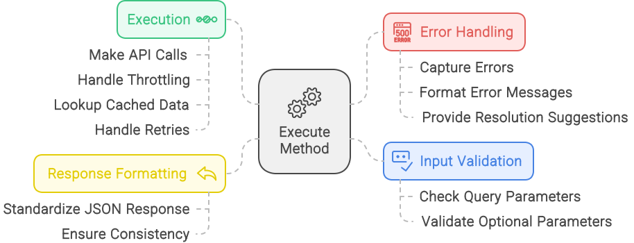

# Core Components

The UIM Protocol consists of several core components that work together to enable seamless interaction between AI agents and web services. This section provides detailed information about each component, including their purpose, structure, and implementation.

## 1. Intents

Intents are the fundamental building blocks of the UIM Protocol. They represent specific actions that an AI agent can perform on a web service, encapsulating all the necessary information to execute the action.

### 1.1 Intent Structure

Each intent includes the following components:

- **Unique Intent Identifier (UID)**: A unique identifier that follows a specific format to ensure global uniqueness
- **Name**: A human-readable name describing the intent's purpose
- **Description**: A detailed explanation of what the intent does
- **Input Parameters**: The data required to execute the intent
- **Output Parameters**: The data returned when the intent is executed
- **Endpoint**: The URL where the intent can be executed
- **Metadata**: Additional information about the intent, such as tags, categories, and version

### 1.2 Unique Intent Identifier (UID) Format

The UID follows a standardized format to ensure global uniqueness:

```
namespace:intent-name:version
```

Where:
- **namespace**: Identifies the service provider (e.g., "example.com")
- **intent-name**: Uniquely identifies the intent within the namespace using lowercase letters, numbers, and hyphens
- **version**: Semantic version number (e.g., "v1", "v2.1")

Example:
```
example.com:search-products:v1
```

### 1.3 Intent Metadata

Intent metadata provides additional information about the intent, helping AI agents understand its purpose and how to use it. The metadata is typically provided in JSON format and includes:

```json
{
  "intent_uid": "example.com:search-products:v1",
  "intent_name": "SearchProducts",
  "description": "Search for products based on criteria",
  "input_parameters": [
    {
      "name": "query",
      "type": "string",
      "required": true,
      "description": "Search query string"
    },
    {
      "name": "category",
      "type": "string",
      "required": false,
      "description": "Product category"
    },
    {
      "name": "price_range",
      "type": "string",
      "required": false,
      "description": "Price range (e.g., '10-100')"
    }
  ],
  "output_parameters": [
    {
      "name": "products",
      "type": "array",
      "description": "List of matching products"
    },
    {
      "name": "total_results",
      "type": "integer",
      "description": "Total number of matching products"
    }
  ],
  "endpoint": {
    "url": "https://api.example.com/products/search",
    "method": "POST",
    "content_type": "application/json"
  },
  "tags": [
    "e-commerce",
    "search",
    "products"
  ],
  "category": "e-commerce",
  "version": "v1"
}
```

### 1.4 Intent Examples

Here are some examples of intents for different domains:

#### E-commerce

- **SearchProducts**: Enables product searches based on various criteria
- **GetProductDetails**: Retrieves detailed information about a specific product
- **PlaceOrder**: Initiates and processes a purchase transaction

#### Travel

- **SearchFlights**: Searches for flights based on criteria like origin, destination, and dates
- **BookFlight**: Books a flight with specified details
- **GetFlightStatus**: Retrieves the status of a flight

#### Finance

- **GetAccountBalance**: Retrieves the balance of a specified account
- **TransferFunds**: Transfers funds between accounts
- **GetTransactionHistory**: Retrieves the transaction history for an account

## 2. Metadata and Parameters

Metadata and parameters provide the context and specifics needed to execute intents effectively. They serve as the blueprint for each intent, detailing its purpose and requirements.

### 2.1 Metadata

Metadata typically includes:

- **Name**: A unique identifier for the intent
- **Description**: A concise explanation of the intent's function
- **Category**: The type of action (e.g., e-commerce, finance, healthcare)
- **Tags**: Keywords that help categorize and discover the intent
- **Version**: The version of the intent, following semantic versioning principles

### 2.2 Parameters

Parameters specify the input required for the intent's execution and the expected output. They are defined with the following attributes:

- **Name**: The name of the parameter
- **Type**: The data type of the parameter (e.g., string, number, boolean, array, object)
- **Required**: Whether the parameter is required or optional
- **Description**: A description of the parameter and its purpose
- **Default**: The default value for the parameter (for optional parameters)
- **Constraints**: Any constraints on the parameter value (e.g., minimum, maximum, pattern)

#### 2.2.1 Input Parameters

Input parameters specify the data that must be provided to execute the intent. For example, a 'SearchProducts' intent might have the following input parameters:

- **query** (string, required): The search term
- **category** (string, optional): The product category filter
- **price_range** (string, optional): The price range filter
- **sort_by** (string, optional): The sorting criteria

#### 2.2.2 Output Parameters

Output parameters specify the data that will be returned when the intent is executed. For example, a 'SearchProducts' intent might have the following output parameters:

- **products** (array): A list of products matching the search criteria
- **total_results** (number): The total number of results found

### 2.3 Parameter Types

The UIM Protocol supports the following parameter types:

- **string**: A sequence of characters
- **number**: A numeric value (integer or floating-point)
- **boolean**: A true or false value
- **array**: An ordered collection of values
- **object**: A collection of key-value pairs
- **null**: A null value
- **any**: Any type of value

### 2.4 Parameter Constraints

Parameters can have constraints that limit the values they can accept. These constraints help ensure that the intent is executed with valid data. Common constraints include:

- **minimum**: The minimum value for a number
- **maximum**: The maximum value for a number
- **minLength**: The minimum length for a string
- **maxLength**: The maximum length for a string
- **pattern**: A regular expression that the string must match
- **enum**: A list of allowed values
- **format**: A specific format for the value (e.g., date, email, URI)

## 3. The Execute Method

The execute method is the operational core of the UIM Protocol. It manages the actual execution of intents, ensuring smooth interaction between AI agents and web services.

### 3.1 Execute Method Workflow

The execute method operates in four key stages:



#### 3.1.1 Input Validation

Before executing an intent, the execute method validates that all required parameters are present and correctly formatted. This ensures that the intent can be executed successfully and reduces the likelihood of errors.

The validation process includes:
- Checking that all required parameters are provided
- Verifying that parameter values match their specified types
- Ensuring that parameter values meet any defined constraints
- Validating the format of complex parameters (e.g., dates, email addresses)

#### 3.1.2 Execution

Once the input is validated, the execute method interacts with the web service's API to perform the requested action. This may involve making HTTP requests, processing responses, and handling errors.

The execution process includes:
- Constructing the appropriate HTTP request based on the intent's endpoint information
- Including the necessary authentication and authorization headers
- Sending the request to the web service
- Receiving and processing the response

#### 3.1.3 Response Formatting

After the intent is executed, the execute method formats the response according to the intent's output parameters. This ensures that the response is consistent and can be easily interpreted by the AI agent.

The response formatting process includes:
- Extracting the relevant data from the web service's response
- Transforming the data to match the expected output parameter structure
- Handling any data type conversions or transformations
- Ensuring that all required output parameters are included

#### 3.1.4 Error Handling

If an error occurs during execution, the execute method provides meaningful feedback to the AI agent. This includes error codes, error messages, and suggestions for resolving the issue.

The error handling process includes:
- Detecting and categorizing errors (e.g., validation errors, execution errors, response errors)
- Generating appropriate error messages and codes
- Providing suggestions for resolving the error when possible
- Ensuring that errors are communicated in a consistent format

### 3.2 Execute Method API

The execute method is typically exposed as an API endpoint that AI agents can call to execute intents. The API endpoint accepts the following parameters:

- **intent_uid** (string, required): The unique identifier of the intent to execute
- **parameters** (object, required): The input parameters for the intent

Example request:

```http
POST /api/intents/execute HTTP/1.1
Host: api.example.com
Content-Type: application/json
Authorization: Bearer <PAT>

{
  "intent_uid": "example.com:search-products:v1",
  "parameters": {
    "query": "laptop",
    "category": "electronics",
    "price_range": "1000-2000"
  }
}
```

Example response:

```http
HTTP/1.1 200 OK
Content-Type: application/json

{
  "products": [
    {
      "id": "123",
      "name": "Gaming Laptop",
      "price": 1500,
      "category": "electronics"
    },
    {
      "id": "456",
      "name": "Business Laptop",
      "price": 1200,
      "category": "electronics"
    }
  ],
  "total_results": 2
}
```

### 3.3 Error Responses

When an error occurs during execution, the execute method returns an error response with the following structure:

```json
{
  "error": {
    "code": "ERROR_CODE",
    "message": "Descriptive error message",
    "details": {
      "additional": "context-specific information"
    }
  }
}
```

Common error codes include:

- **INVALID_PARAMETER**: One or more parameters are invalid or missing
- **UNAUTHORIZED**: The request is not authenticated or the authentication token is invalid
- **FORBIDDEN**: The client is authenticated but does not have permission to execute the intent
- **NOT_FOUND**: The requested intent or resource was not found
- **INTERNAL_SERVER_ERROR**: An unexpected error occurred on the server

## 4. Policy Adherence Tokens (PATs)

Policy Adherence Tokens (PATs) are digitally signed tokens that encapsulate permissions, usage limits, billing agreements, and compliance terms. They ensure secure and compliant interactions between AI agents and web services.

### 4.1 PAT Structure

PATs are implemented as JSON Web Tokens (JWTs) with the following claims:

#### 4.1.1 Required Claims

- **iss** (Issuer): The service identifier that issued the token
- **sub** (Subject): The AI agent identifier that the token was issued to
- **exp** (Expiration Time): The time after which the token is no longer valid
- **nbf** (Not Before): The time before which the token is not valid
- **jti** (JWT ID): A unique identifier for the token
- **scope**: An array of permitted intents and operations

#### 4.1.2 Additional Claims

- **pol** (Policy): A reference to the policy that the token adheres to
- **lmt** (Limits): Rate limiting parameters and other usage constraints

Example PAT structure:

```json
{
  "iss": "example.com",
  "sub": "ai-agent-123",
  "exp": 1609459200,
  "nbf": 1609372800,
  "jti": "abc123",
  "scope": ["example.com:search-products:v1:execute"],
  "pol": "https://example.com/policy.json",
  "lmt": {
    "rate": 100,
    "period": 3600
  }
}
```

### 4.2 PAT Issuance Workflow

The PAT issuance workflow involves the following steps:

1. **Policy Retrieval and Agreement**:
   - AI agent retrieves the policy from the specified endpoint
   - AI agent digitally signs the policy using its private key and sends it to the web service alongside its public key to request a PAT

2. **PAT Issuance**:
   - Web service verifies the AI agent's signature and agreement
   - Web service issues a PAT, which includes the agreed policy details, permissions, obligations, and a validity period
   - The PAT is digitally signed by the web service

3. **Using PAT in Requests**:
   - AI agent includes the PAT in the `Authorization` header of each request
   - Web service verifies the PAT's signature and validity before processing the request

### 4.3 PAT Verification

When a web service receives a request with a PAT, it performs the following verification steps:

1. **Signature Verification**: Verifies that the PAT was signed by the web service and has not been tampered with
2. **Expiration Check**: Ensures that the PAT has not expired
3. **Scope Verification**: Confirms that the PAT grants permission to execute the requested intent
4. **Rate Limit Check**: Ensures that the AI agent has not exceeded the rate limits specified in the PAT

### 4.4 PAT Renewal

PATs have a limited validity period and must be renewed periodically. The renewal process typically involves:

1. **Renewal Request**: AI agent sends a renewal request to the web service, including the current PAT
2. **Policy Verification**: Web service verifies that the AI agent still adheres to the policy
3. **New PAT Issuance**: Web service issues a new PAT with an updated expiration time

### 4.5 PAT Revocation

In some cases, a web service may need to revoke a PAT before it expires. This can happen if:

- The AI agent violates the policy
- The policy changes and requires re-agreement
- The web service detects suspicious activity

When a PAT is revoked, the web service adds it to a revocation list and rejects any requests that include the revoked PAT.

## 5. Discovery Mechanisms

The UIM Protocol provides mechanisms for AI agents to discover available intents and services. These mechanisms include DNS TXT records and `agents.json` files.

### 5.1 DNS TXT Records

Services publish discovery information using DNS TXT records. Each record contains one of the following fields:

- **uim-agents-file**: URL of the service description file (REQUIRED)
  Example: "uim-agents-file=https://example.com/agents.json"

- **uim-api-discovery**: URL of the discovery endpoint (OPTIONAL)
  Example: "uim-api-discovery=https://api.example.com/discovery"

- **uim-policy-file**: URL of the policy file (REQUIRED)
  Example: "uim-policy-file=https://example.com/policy.json"
  
- **uim-license**: The UIM license for the service (OPTIONAL)
  Example: "uim-license=https://uimprotocol.com/licenses/uim-by-nc-v1.0"

### 5.2 `agents.json` Files

`agents.json` files contain detailed information about the service and available intents. They use the following structure:

```json
{
  "service-info": {
    "name": "Example Service",
    "description": "Service description",
    "service_url": "https://api.example.com",
    "service_logo_url": "https://example.com/logo.png",
    "service_terms_of_service_url": "https://example.com/terms",
    "service_privacy_policy_url": "https://example.com/privacy"
  },
  "intents": [
    {
      "intent_uid": "example.com:search-products:v1",
      "intent_name": "SearchProducts",
      "description": "Search for products based on criteria",
      "input_parameters": [...],
      "output_parameters": [...],
      "endpoint": {...},
      "tags": [...]
    }
  ],
  "uim-public-key": "base64-encoded-public-key",
  "uim-policy-file": "https://example.com/policy.json",
  "uim-api-discovery": "https://api.example.com/discovery",
  "uim-compliance": {
    "standards": ["ISO27001", "GDPR"],
    "regional-compliance": {
      "EU": "GDPR",
      "US-CA": "CCPA"
    },
    "notes": "Data is encrypted in transit and at rest."
  },
  "uim-license": "https://uimprotocol.com/licenses/uim-by-nc-v1.0"
}
```

### 5.3 Discovery Process

The discovery process typically follows these steps:

1. **DNS Query**: AI agent queries the DNS TXT records for the service domain to find the `agents.json` file URL or discovery endpoint
2. **Retrieve `agents.json`**: AI agent retrieves the `agents.json` file from the specified URL
3. **Parse Intent Information**: AI agent parses the intent information from the `agents.json` file
4. **Query Discovery Endpoint**: If a discovery endpoint is specified, AI agent can query it for more detailed information about available intents

### 5.4 Intent Search

AI agents can search for intents based on various criteria, such as:

- **Intent UID**: Search for a specific intent by its unique identifier
- **Intent Name**: Search for intents with a specific name
- **Tags**: Search for intents with specific tags
- **Category**: Search for intents in a specific category
- **Description**: Search for intents whose description contains specific keywords

Example search request:

```http
GET /api/intents/search?tags=e-commerce,search&category=shopping HTTP/1.1
Host: api.example.com
```

Example search response:

```json
{
  "intents": [
    {
      "intent_uid": "example.com:search-products:v1",
      "intent_name": "SearchProducts",
      "description": "Search for products based on criteria",
      "input_parameters": [...],
      "output_parameters": [...],
      "endpoint": {...},
      "tags": ["e-commerce", "search", "products"],
      "category": "shopping"
    }
  ]
}
```

## 6. Integration with Open Digital Rights Language (ODRL)

The UIM Protocol integrates with the Open Digital Rights Language (ODRL) Information Model 2.2 to define and manage permissions, prohibitions, and obligations. This integration enhances the security, compliance, and efficiency of interactions between AI agents and web services.

### 6.1 Key ODRL Concepts

- **Policy**: Represents the agreement between AI agents and web services, detailing permissions, prohibitions, and obligations
- **Permission**: Specifies allowed actions for AI agents
- **Prohibition**: Specifies actions that AI agents are not allowed to perform
- **Obligation**: Specifies actions that AI agents must perform under certain conditions
- **Asset**: The resource or service the policy applies to
- **Party**: The entities involved in the policy (e.g., AI agents and web services)

### 6.2 Example ODRL Policy for UIM Integration

```json
{
  "@context": "http://www.w3.org/ns/odrl.jsonld",
  "uid": "http://example.com/policy/12345",
  "type": "Set",
  "profile": "http://example.com/profile/odrl-uim",
  "permission": [
    {
      "target": "http://example.com/api/intents",
      "action": "execute",
      "constraint": [
        {
          "leftOperand": "http://example.com/vocab/rateLimit",
          "operator": "lte",
          "rightOperand": 1000,
          "unit": "http://example.com/vocab/hour"
        }
      ],
      "duty": [
        {
          "action": "pay",
          "target": "http://example.com/vocab/intentPrice",
          "amount": 0.01,
          "unit": "http://example.com/vocab/USD"
        }
      ]
    }
  ],
  "prohibition": [
    {
      "target": "http://example.com/api/intents",
      "action": "exceedRateLimit"
    }
  ],
  "obligation": [
    {
      "action": "signPayload",
      "assignee": "http://example.com/ai-agent/1",
      "target": "http://example.com/vocab/payload",
      "constraint": [
        {
          "leftOperand": "http://example.com/vocab/publicKey",
          "operator": "use",
          "rightOperand": "MIIBIjANBgkqh..."
        }
      ]
    }
  ],
  "party": [
    {
      "function": "assigner",
      "identifier": "http://example.com/web-service/1"
    },
    {
      "function": "assignee",
      "identifier": "http://example.com/ai-agent/1"
    }
  ],
  "asset": "http://example.com/api/intents"
}
```

### 6.3 Benefits of ODRL Integration

- **Standardization of Policies**: ODRL provides a standardized way to define permissions, prohibitions, and obligations
- **Flexibility and Interoperability**: ODRL's flexible framework allows it to be adapted to various use cases and requirements
- **Clear and Verifiable Terms**: By defining policies in ODRL, web services can provide clear, precise, and verifiable terms of service
- **Enhanced Security and Compliance**: ODRL allows the definition of detailed security and compliance requirements
- **Automated Enforcement**: ODRL policies can be enforced automatically by the UIM protocol

## 7. Summary

The core components of the UIM Protocol—Intents, Metadata and Parameters, the Execute Method, Policy Adherence Tokens, and Discovery Mechanisms—work together to create a standardized framework for AI agents to interact with web services. By understanding these components, developers can implement the protocol in their applications and enable seamless, efficient interactions between AI agents and web services.
