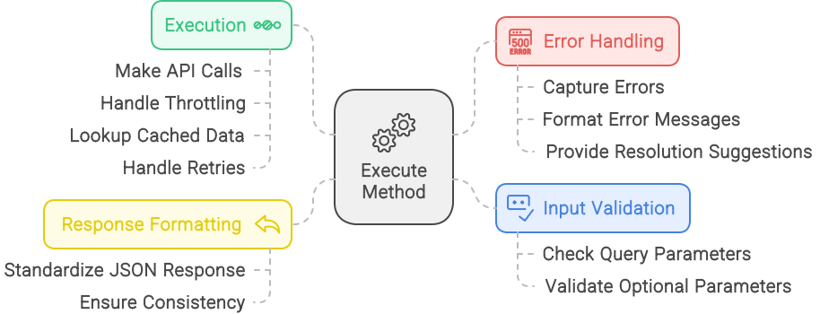

# Key Concepts

The UIM Protocol is built on three fundamental concepts: Intents, Metadata and Parameters, and the Execute Method. Each plays a crucial role in facilitating efficient communication between AI agents and web services.

## Intents

Intents are the core building blocks of the UIM Protocol. They represent specific, predefined actions that an AI agent can perform on a web service. By standardizing these actions, UIM creates a common language for interaction, significantly reducing complexity and enhancing efficiency.

In practical terms, an intent is analogous to a function call in programming. It encapsulates a discrete task, complete with the necessary information to execute it.

### Intent Structure

Each intent MUST include:

- **Identifier**: A unique identifier following the format specified in the [Unique Intent Identifier (UID) Format](#unique-intent-identifier-uid-format).
- **Name**: A human-readable name describing the intent's purpose.
- **Description**: A detailed explanation of the intent's functionality and usage.
- **Parameters**: Input and output parameter definitions, including types and constraints.
- **Endpoint**: Information required to execute the intent.
- **Metadata**: Additional intent properties as defined in the [Intent Metadata](#intent-metadata) section.

### Unique Intent Identifier (UID) Format

Intent identifiers MUST follow the format:

```
namespace:intent-name:version
```

Where:

- **namespace**: Identifies the service provider (e.g., "example.com")
- **intent-name**: Uniquely identifies the intent within the namespace using lowercase letters, numbers, and hyphens
- **version**: Semantic version number (e.g., "v1", "v2.1")

Example:
```
example.com:search-products:v1
```

### Intent Metadata

Intent metadata MUST use the following JSON structure:

```json
{
  "intent_uid": "example.com:search-products:v1",
  "intent_name": "SearchProducts",
  "description": "Search for products based on criteria",
  "input_parameters": [
    {
      "name": "query",
      "type": "string",
      "required": true,
      "description": "Search query string"
    }
  ],
  "output_parameters": [
    {
      "name": "products",
      "type": "array",
      "description": "List of matching products"
    }
  ],
  "endpoint": {
    "url": "https://api.example.com/products/search",
    "method": "POST",
    "content_type": "application/json"
  },
  "tags": [
    "e-commerce",
    "search",
    "products"
  ]
}
```

### Intent Examples

Here are some examples of intents for different domains:

#### E-commerce

- **SearchProducts**: Enables product searches based on various criteria
- **GetProductDetails**: Retrieves detailed information about a specific product
- **PlaceOrder**: Initiates and processes a purchase transaction

#### Travel

- **SearchFlights**: Searches for flights based on criteria like origin, destination, and dates
- **BookFlight**: Books a flight with specified details
- **GetFlightStatus**: Retrieves the status of a flight

#### Finance

- **GetAccountBalance**: Retrieves the balance of a specified account
- **TransferFunds**: Transfers funds between accounts
- **GetTransactionHistory**: Retrieves the transaction history for an account

## Metadata and Parameters

Metadata and parameters provide the context and specifics needed to execute intents effectively. They serve as the blueprint for each intent, detailing its purpose and requirements.

### Metadata

Metadata typically includes:

- **Name**: A unique identifier for the intent
- **Description**: A concise explanation of the intent's function
- **Category**: The type of action (e.g., e-commerce, finance, healthcare)
- **Tags**: Keywords that help categorize and discover the intent

### Parameters

Parameters specify the input required for the intent's execution and the expected output. They are defined with the following attributes:

- **Name**: The name of the parameter
- **Type**: The data type of the parameter (e.g., string, number, boolean, array, object)
- **Required**: Whether the parameter is required or optional
- **Description**: A description of the parameter and its purpose
- **Default**: The default value for the parameter (for optional parameters)
- **Constraints**: Any constraints on the parameter value (e.g., minimum, maximum, pattern)

#### Input Parameters

Input parameters specify the data that must be provided to execute the intent. For example, a 'SearchProducts' intent might have the following input parameters:

- **query** (string, required): The search term
- **category** (string, optional): The product category filter
- **price_range** (string, optional): The price range filter
- **sort_by** (string, optional): The sorting criteria

#### Output Parameters

Output parameters specify the data that will be returned when the intent is executed. For example, a 'SearchProducts' intent might have the following output parameters:

- **products** (array): A list of products matching the search criteria
- **total_results** (number): The total number of results found

## The Execute Method

The execute method is the operational core of the UIM Protocol. It manages the actual execution of intents, ensuring smooth interaction between AI agents and web services. The method operates in four key stages:



### 1. Input Validation

Before executing an intent, the execute method validates that all required parameters are present and correctly formatted. This ensures that the intent can be executed successfully and reduces the likelihood of errors.

### 2. Execution

Once the input is validated, the execute method interacts with the web service's API to perform the requested action. This may involve making HTTP requests, processing responses, and handling errors.

### 3. Response Formatting

After the intent is executed, the execute method formats the response according to the intent's output parameters. This ensures that the response is consistent and can be easily interpreted by the AI agent.

### 4. Error Handling

If an error occurs during execution, the execute method provides meaningful feedback to the AI agent. This includes error codes, error messages, and suggestions for resolving the issue.

## Policy Adherence Tokens (PATs)

Policy Adherence Tokens (PATs) are digitally signed tokens that encapsulate permissions, usage limits, billing agreements, and compliance terms. They ensure secure and compliant interactions between AI agents and web services.

### PAT Structure

PATs MUST be implemented as JSON Web Tokens (JWTs) with the following claims:

#### Required Claims

- **iss**: Token issuer (the service identifier)
- **sub**: Subject (the AI agent identifier)
- **exp**: Expiration time
- **nbf**: Not before time
- **jti**: JWT ID (unique identifier for the token)
- **scope**: Array of permitted intents and operations

#### Additional Claims

- **pol**: Policy reference URL
- **lmt**: Rate limiting parameters

### PAT Issuance Workflow

1. **Policy Retrieval and Agreement**:
   - AI agent retrieves the policy from the specified endpoint.
   - AI agent digitally signs the policy using its private key and sends it to the web service alongside its public key to request a PAT.

2. **PAT Issuance**:
   - Web service verifies the AI agent's signature and agreement.
   - Web service issues a PAT, which includes the agreed policy details, permissions, obligations, and a validity period.
   - The PAT is digitally signed by the web service.

3. **Using PAT in Requests**:
   - AI agent includes the PAT in the `Authorization` header of each request.
   - Web service verifies the PAT's signature and validity before processing the request.

## Discovery Mechanisms

The UIM Protocol provides mechanisms for AI agents to discover available intents and services. These mechanisms include DNS TXT records and `agents.json` files.

### DNS TXT Records

Services MUST publish discovery information using DNS TXT records. Each record MUST contain one of the following fields:

- **uim-agents**: URL of the service description file (REQUIRED)
  Example: "uim-agents=https://example.com/agents.json"

- **uim-discovery**: URL of the discovery endpoint (OPTIONAL)
  Example: "uim-discovery=https://api.example.com/discovery"

- **uim-policy**: URL of the policy file (REQUIRED)
  Example: "uim-policy=https://example.com/policy.json"

### `agents.json` Files

`agents.json` files contain detailed information about the service and available intents. They MUST use the following structure:

```json
{
  "service-info": {
    "name": "Example Service",
    "description": "Service description",
    "service_url": "https://api.example.com",
    "service_logo_url": "https://example.com/logo.png",
    "service_terms_of_service_url": "https://example.com/terms",
    "service_privacy_policy_url": "https://example.com/privacy"
  },
  "intents": [
    {
      "intent_uid": "example.com:search-products:v1",
      "intent_name": "SearchProducts",
      "description": "Search for products based on criteria",
      "input_parameters": [...],
      "output_parameters": [...],
      "endpoint": {...},
      "tags": [...]
    }
  ],
  "uim-public-key": "base64-encoded-public-key",
  "uim-policy-file": "https://example.com/policy.json",
  "uim-api-discovery": "https://api.example.com/discovery",
  "uim-compliance": {
    "standards": ["ISO27001", "GDPR"],
    "regional-compliance": {
      "EU": "GDPR",
      "US-CA": "CCPA"
    },
    "notes": "Data is encrypted in transit and at rest."
  }
}
```

## Summary

The key concepts of the UIM Protocol—Intents, Metadata and Parameters, and the Execute Method—work together to create a standardized framework for AI agents to interact with web services. By understanding these concepts, developers can implement the protocol in their applications and enable seamless, efficient interactions between AI agents and web services.
