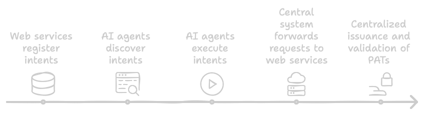
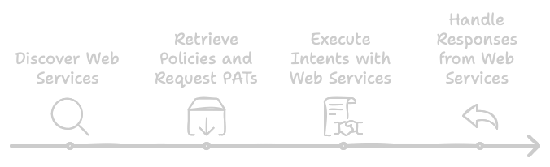

# UIM Protocol Overview

## Introduction

The Unified Intent Mediator (UIM) Protocol defines a standardized framework for AI agents to interact with web services through well-defined intents, metadata, and execution methods. By introducing consistency and security in these interactions, UIM enhances efficiency, scalability, and reliability for AI-driven applications.

## Problem Statement

Current methods of integration between AI agents and web services face several challenges:

- **Integration methods are fragmented** and use inconsistent APIs.
- **Service discovery mechanisms are limited or non-existent**.
- **Policy enforcement and compliance requirements are complex**.
- **Access to advanced service features is often restricted**.
- **Security and authentication mechanisms vary widely**.

The UIM Protocol addresses these challenges by providing a standardized framework for intent-based interactions.

## Protocol Goals

The UIM Protocol aims to:

1. **Standardize Interactions**: Create a consistent way for AI agents to discover and interact with web services.
2. **Enhance Security**: Provide robust authentication and authorization mechanisms.
3. **Simplify Integration**: Reduce the complexity of integrating AI agents with web services.
4. **Enable Advanced Functionality**: Allow AI agents to access a wide range of web service features.
5. **Ensure Compliance**: Provide mechanisms for enforcing policies and ensuring compliance with regulations.

## Key Features

- **Intent-Based Communication**: Standardized format for expressing user intents that can be understood by both AI agents and web services.
- **Secure Authentication**: Robust authentication mechanisms using RSA key pairs for secure data transmission.
- **Service Discovery**: Centralized discovery service that allows AI agents to find and interact with compatible web services.
- **Policy Management**: System for defining and enforcing usage policies, permissions, and constraints.
- **Mock Implementations**: Reference implementations (mock agent and webservice) to demonstrate the protocol in action.

## Protocol Components

The UIM Protocol consists of several key components:

### 1. Intents

Intents are predefined actions that an AI agent can perform on a web service. They encapsulate specific tasks, including necessary parameters and execution details.

### 2. Metadata and Parameters

Each intent includes metadata (name, description, category) and parameters (input and output) that provide context and specifics for execution.

### 3. Execute Method

The execute method manages the actual execution of intents, ensuring smooth interaction between AI agents and web services.

### 4. Policy Adherence Tokens (PATs)

PATs are digitally signed tokens that encapsulate permissions, usage limits, billing agreements, and compliance terms.

### 5. Discovery Mechanisms

The protocol provides mechanisms for AI agents to discover available intents and services, including DNS TXT records and `agents.json` files.

## Protocol Operation

The protocol operates through the following steps:

1. **Service Registration**: Services register their intents and capabilities using one or more discovery mechanisms.
2. **Intent Discovery**: AI agents discover available services and intents through DNS-based discovery, service description retrieval, or direct endpoint queries.
3. **Policy Acquisition**: Before executing intents, AI agents obtain Policy Adherence Tokens (PATs) by authenticating with the service, accepting applicable policies, and receiving a signed PAT.
4. **Intent Execution**: AI agents execute intents by preparing a valid request with required parameters, including a valid PAT, sending the request to the specified endpoint, and processing the response according to intent metadata.

## Architecture Models

The UIM Protocol supports three architectural models:

### Centralized Model

Uses a central repository for intent discovery and management. All service registrations and intent discoveries pass through a central authority.

### Decentralized Model

Enables direct interaction between agents and services without intermediaries. Services maintain their own intent registries.

### Hybrid Model

Combines centralized and decentralized approaches, allowing flexibility in deployment while maintaining consistency.

## Benefits

The UIM Protocol offers numerous benefits:

- **Streamlined Interaction**: Eliminates the need for simulated user actions.
- **Enhanced Functionality**: Exposes a wide range of web service functionalities as intents.
- **New Revenue Streams**: Allows service providers to monetize intent access/usage.
- **Improved Efficiency**: Reduces task completion time and enhances user experience.
- **Robust Security**: Incorporates encrypted communications and secure authentication.

## Next Steps

To learn more about the UIM Protocol, explore the following sections:

- [Key Concepts](key-concepts.md): Detailed information about intents, metadata, and the execute method.
- [Architecture](architecture.md): In-depth discussion of the different architectural models.
- [Core Components](core-components.md): Detailed specifications for each component of the protocol.
